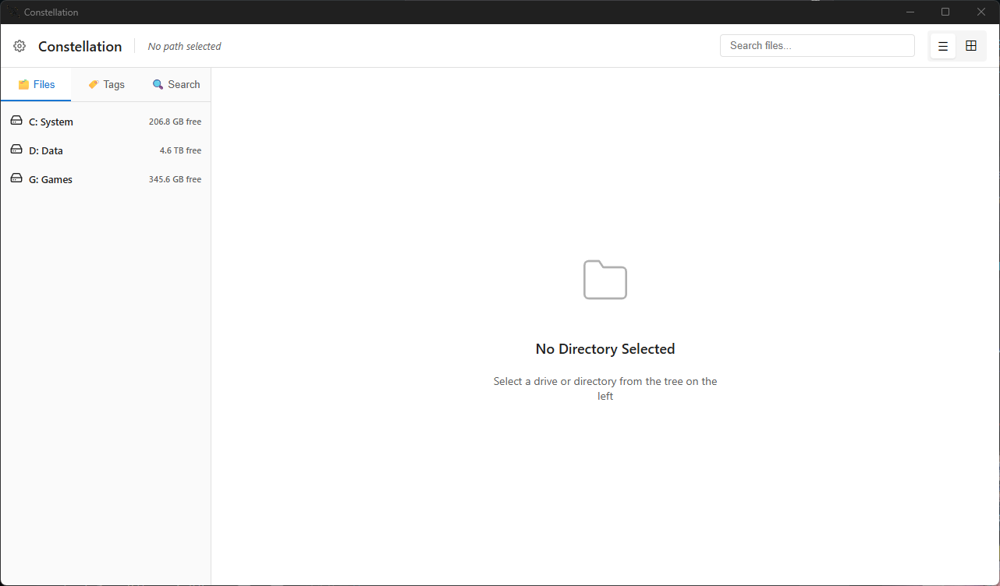
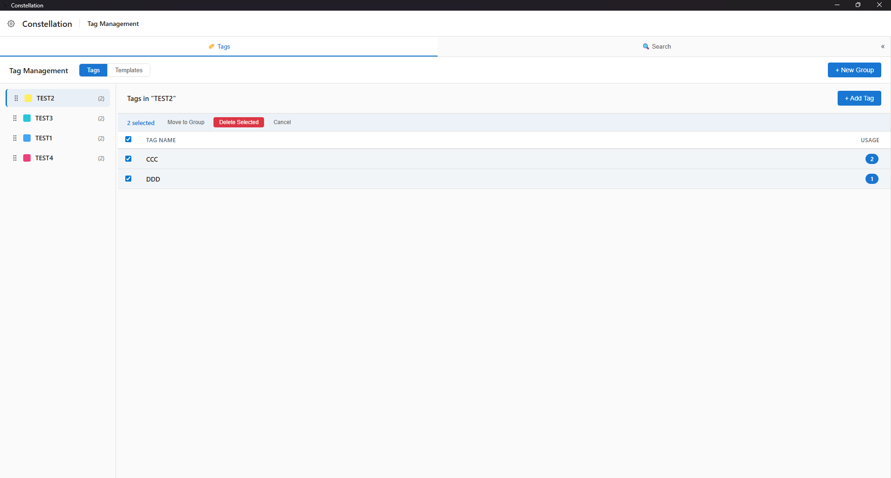
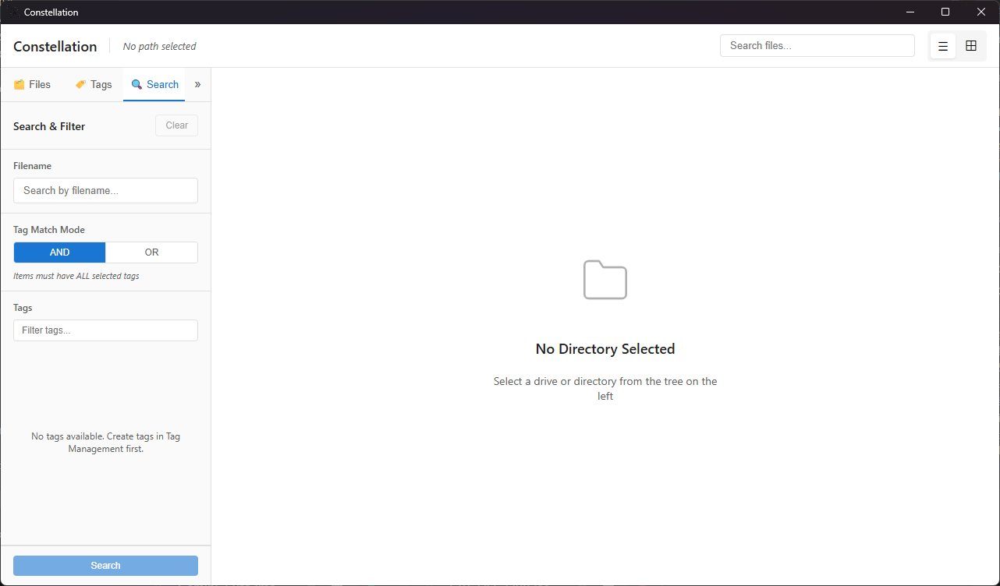

# Constellation

<p align="center">
  <strong>Organize your universe of files.</strong>
</p>

<p align="center">
  
</p>

Constellation is a modern, high-performance desktop application for organizing files using a flexible and powerful tag system. Built with **Rust** and **Tauri**, it offers a blazing fast experience for managing your digital assets.

---

## 📸 Functionality Previews

| **Tag Management** | **Search & Filtering** |
|:---:|:---:|
|  |  |
| *Organize tags with groups and colors* | *Powerful search with fuzzy matching* |

---

## ✨ Key Features

- **🚀 Smart File Browser**
  - **Tree View**: Navigate drives and directories with a familiar, lazy-loaded interface.
  - **Virtual Scrolling**: Smoothly handle folders containing thousands of files.
  - **Local Trace**: Instantly filter files in the current view with fuzzy matching.

- **🏷️ Advanced Tag System**
  - **Dynamic Tags**: Tag display automatically adapts to window size, ensuring visibility.
  - **Tag Groups**: Color-coded categories (e.g., "Priority", "Status") for better organization.
  - **Inline Editing**: Add, remove, and manage tags directly from the file list.
  - **Tag Templates**: Save frequent tag combinations for one-click application.

- **🔍 Powerful Search**
  - **Global Tag Search**: Find files across your entire library by selecting multiple tags.
  - **Tag List Search**: Quickly locate specific tags within your collection using the search bar.

- **🧘 Zen Mode**
  - Expand the tag management sidebar to focus purely on organization.
  - Adaptive UI hides unnecessary elements for a cleaner, focused workflow.

## 🛠️ Tech Stack

- **Core**: [Rust](https://www.rust-lang.org/) + [Tauri 2.0](https://tauri.app/)
- **Frontend**: [Vue 3](https://vuejs.org/) + TypeScript + Pinia
- **Database**: SQLite (via rusqlite)
- **Styling**: Modern CSS variables & Flexbox/Grid

## 🚀 Getting Started

### Prerequisites
- [Rust](https://rustup.rs/) (latest stable)
- [Node.js](https://nodejs.org/) (v18+)

### Installation

```bash
# 1. Install dependencies
npm install

# 2. Run in development mode
npm run tauri dev
```

### Building for Production

```bash
npm run tauri build
```
The executable will be located in `src-tauri/target/release/bundle/`.

## 📂 Project Structure

```bash
constellation/
├── src/                    # Frontend Source (Vue)
│   ├── components/         # UI Components
│   └── stores/             # State Management
├── src-tauri/              # Backend Source (Rust)
│   ├── src/                # Rust Logic & DB Layer
│   └── tauri.conf.json     # Configuration
└── assets/                 # Project assets & screenshots
```

## 📄 License
GNU GPLv3

## 👏 Acknowledgements
- App Icons designed by [Freepik](https://www.flaticon.com/) from [Flaticon](https://www.flaticon.com/).
